# Tarea 2: Manipulación de repositorios en Git
##### Alumno: Carlos Javier Oliva Domínguez 
##### N. Lista: 26

### Descripción de la tarea
*La siguiente tarea tiene como objetivo que el alumno se familiarice con la creación y manipulación de repositorios en GIT. Para conseguirlo se irán describiendo los pasos necesarios para la realización de cada una de las acciones necesarias.*

**Índice**

0. [Preparando la máquina](#id0)
1. [Configuración](#id1)
2. [Creación de un repositorio](#id2)
3. [Comprobar el estado del repositorio](#id3)
4. [Realizando Commit´s](#id4)
5. [Modificación de ficheros](#id5)
6. [Historial](#id6)

---
### Tareas

## 0. Preparando la máquina
Primeramente vamos a preparar la máquina para actualizar los paquetes y crear el arbol de dependencias de Linux. 
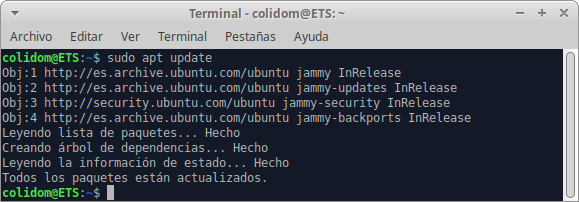

Posteriormente instalaremos git en la misma ya que no viene por defecto.
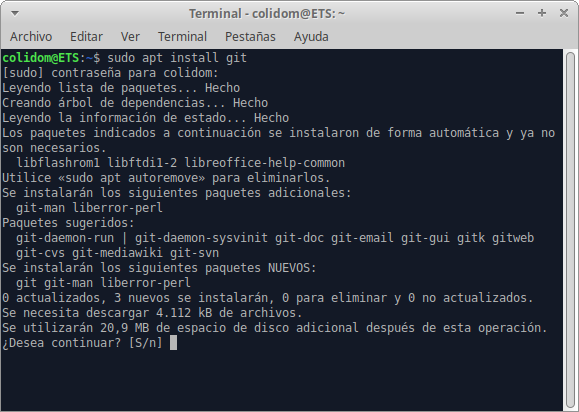

Podremos comprobar que se ha instalado correctamente mediante el comando `git --version`.
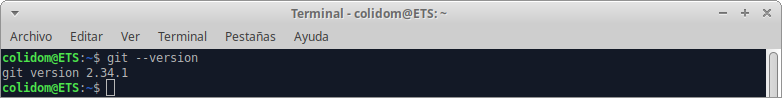

## Configuración
Acto seguido configuraremos Git definiendo el nombre del usuario, el correo electrónico y activando el coloreado de la salida.
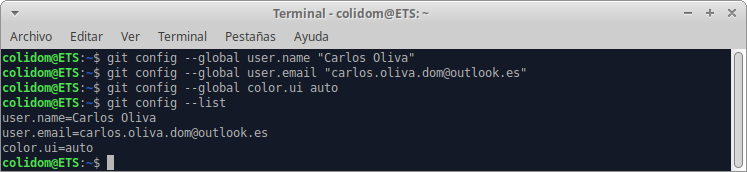

## Creación de un repositorio
Ahora crearemos un repositorio nuevo con el nombre dpl.
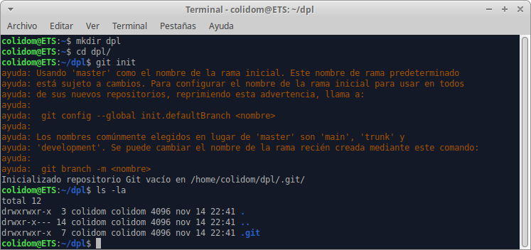

## Comprobar el estado del repositorio
Vamos a comprobar el estado del repositorio y como lo hemos creado hace apenas unos instantes comprobaremos que el control de versiones nos alerta de que `No hay commits todavía`, lo cual es correcto porque aún no hemos añadido ningún cambio.
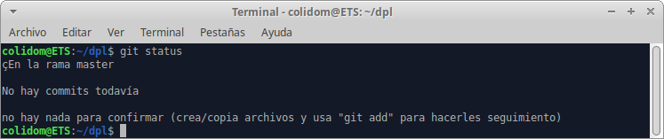

Eso está a punto de cambiar, crearemos un fichero llamado indice.txt y añadiremos contenido al mismo.
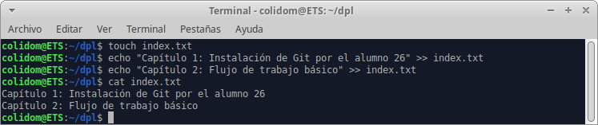

Mediante el comando `git status` comprobaremos el estado del repositorio en local y comprobaremos que hay cambios nuevos pero que aún no se han añadido al *STAGE*(mostrando el nombre del fichero en color rojo).

>El STAGE es donde añadiremos los ficheros que han sido modificados para posteriormente añadir un commit que haga referencia a los cambios del mismo.

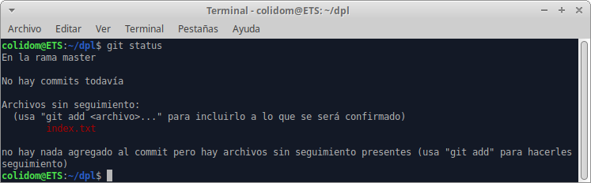

El comando `git add` nos permite añadir al STAGE los ficheros que han sido modificados. Como se puede ver, una vez añadidos están en el STAGE(mostrando el nombre del fichero en color verde).
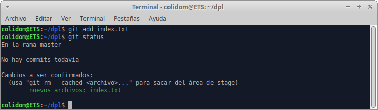

## Realizando Commit´s
Añadiremos un commit descriptivo que explique brevemente los cambios que hemos hecho en el fichero y mostramos el estado del mismo.
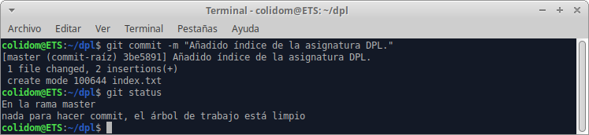

## Modificación de ficheros
Lo siguiente será añadir nuevas líneas a nuestro fichero, haremos uso del comando `git status` y veremos que pasa...
Git nos dice que el fichero ha sido modificado y lo representa en color rojo. Además de informarnos que hagamos un `git add` y/o `git commit -a` que añade todos los ficheros modificados al STAGE.
> El parámetro * al añadir los ficheros(git add) indica que queremos añadir todos los ficheros modificados que hay en nuestro local.

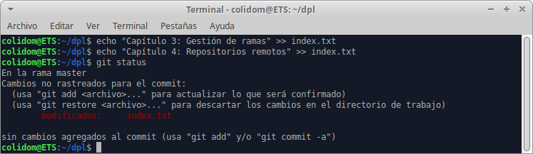

Ejecutamos los comandos y veremos que 
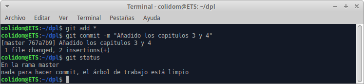

## Historial
Mostraremos los cambios de la última versión del repositorio con respecto a la anterior con el comando `git show`.
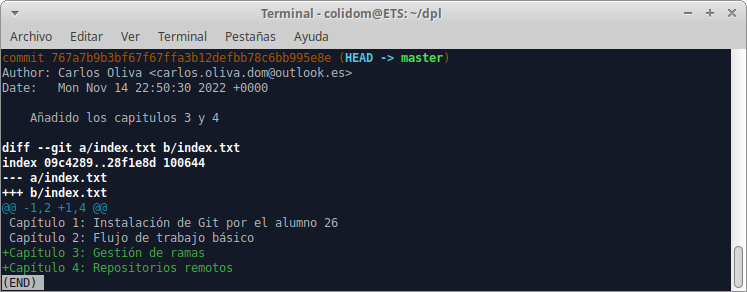

Dado el caso de equivocarnos, podemos corregir el mensaje del commit si aún no lo hemos subido al origen(servidor), para ello haremos uso del comando `git --amend` y cambiaremos el commit.
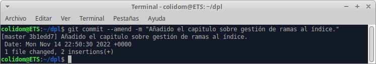
Una vez hayamos añadido el nuevo mensaje vamos a mostrar nuevamente el último cambio realizado.
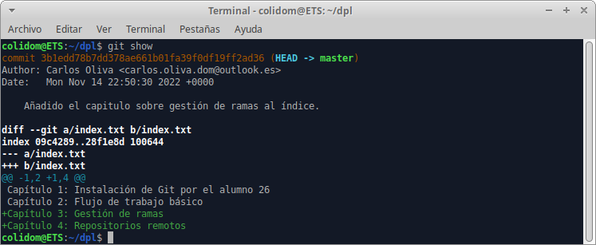
