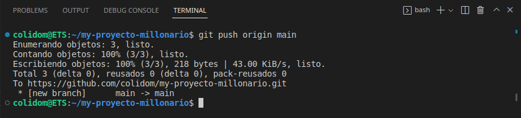
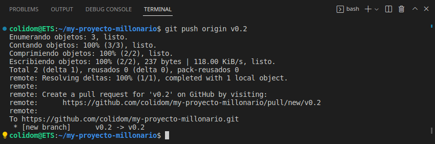
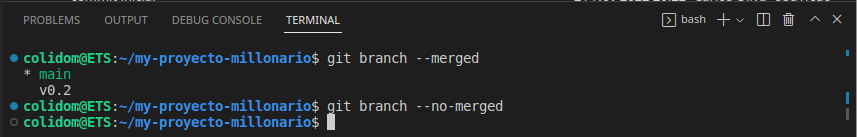

## Tarea3: Manipulación Avanzada en Git (trabajo con tags y ramas)
Alumno: Carlos Javier Oliva Domínguez
N. Lista: 26

## Trabajo diario a través de git

##### Creando y clonando repositorio **my-proyecto-millonario**.

##### Creamos fichero README.md.

##### Commit inicial
Añadimos el fichero creado al `stage` y hacemos commit.

##### Push inicial
Pusheamos estos cambios al origin.

**Respuesta pregunta:** git push ~~origin master~~
##### Ignorar archivos
Creamos fichero `privado.txt`, carpeta `privada` y les añadimos al fichero `.gitignore` que es el encargado de "decirle" a Git que no tenga en cuenta los nombres de ficheros/carpetas que allí se encuentran.

**Respuesta pregunta:** Cualquier fichero/carpeta añadido al fichero `.gitignore` será ignorado por Git y no se subirá al repositorio.

Finalmente hacemos commit de los cambios anteriores

##### Añadir fichero 1.txt
Creamos, añadimos al `stage` y commiteamos el fichero 1.txt.

**Respuesta pregunta:** 
- `git add .` añade todos los ficheros/carpetas que han sido creados recientemente, que han sufrido cambios y que no están en el fichero `.gitignore`.
- `git commit -m` añade un mensaje relacionado con la modificación del fichero, se deberá poner una descripción concisa de los cambios realizados.

Finalmente pusheamos los cambios al origin. Además crearemos la **etiqueta** `v0.1` y la pusheamos al origin.

##### Crear una rama v0.2 y añadir fichero 2.txt
Creamos la rama v0.2, nos movemos a ella mediante el comando `git checkout v0.2`, añadimos fichero 2.txt y hacemos commit de lo anterior.

**Respuesta pregunta:** El fin es separar en areas de trabajo independiente las tareas y/o funcionalidades que hacen cada uno de los desarrolladores o integrantes del proyecto y el sentido que tiene es trabajar de una forma organizada, tener un control de versiones con su histórico y demás funcionalidades, etc. 

##### Crear rama remota v0.2
Finalmente, pusheamos la rama al origin

##### Merge directo
Ahora nos posicionamos en nuestra rama principal, en mi caso `main`.

Mergeamos la rama `v0.2` que creamos antes con `main`.

**Respuesta pregunta:** No, no se generarían conflictos ya que los cambios fusionados en el merge no cuentan con cambios/versiones de un mismo fichero en ramas distintas.

##### Merge con conflicto
Ahora en la rama `main`, ponemos la palabra `Hola` en el fichero **1.txt**, le añadimos y commiteamos.

Nos movemos de rama usando el comando `git checkout v0.2` y ponemos la palabra `Adios` en el fichero **1.txt**, finalmente le añadimos y commiteamos.

Nos posicionamos nuevamente en la rama `main` y mergeamos la rama `v0.2` en la rama actual(`main`).

~~~
Esto genera un conflicto ya queen ambas ramas `main` y `v0.2` hemos modificado el mismo fichero y tanto en una como en la otra tenemos versiones distintas del mismo fichero, por un lado `main` contiene la palabra `Hola` y `v0.2` contiene `Adios`, esto provoca que haya una diferencia de código y por lo tanto un conflicto en el mismo.
~~~

Mostramos el conflicto en la terminal y vemos como hay un "identificador" llamado `<<<<< HEAD`, `=====` y otro  `>>>>>> v0.2`.
- Desde `<<<<< HEAD` y hasta `=====` indica el contenido del fichero **1.txt** donde está el "puntero de git" en este momento(`llamado HEAD`).
- Desde `=====` hasta `>>>>>> v0.2` muestra los cambios que contiene la rama `v0.2`, es decir, los que entran en la rama principal(`main`).

Sin corregir el conflicto, hacemos commit de los cambios.

##### Listado de ramas
Listaremos las ramas con merge y las ramas sin merge.

##### Arreglar conflicto
Para arreglar el conflicto abriremos el ficheri **1.txt** con un editor de texto y modificaremos su contenido según queramos.

- Como no me quedaba claro lo que se pedía esta parte sobre "arreglar el conflicto" lo he hecho como he crerído oportuno, quedándome con ambos cambios que en una situación normal creo es lo más usual.

Ahora hacemos add y commit sobre los cambios realizados.

Pusheamos al origin.

##### Borrar rama y listado de cambios
Crearemos primeramente un tag llamado `v0.2` y borramos la rama `v0.2`.
Además podremos ver, gráficamente, los cambios que hemos ido haciendo en el repositorio.

