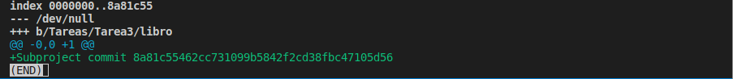
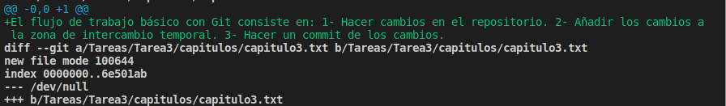
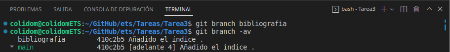
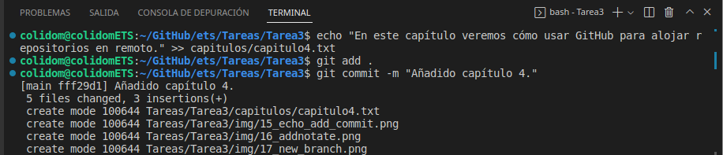
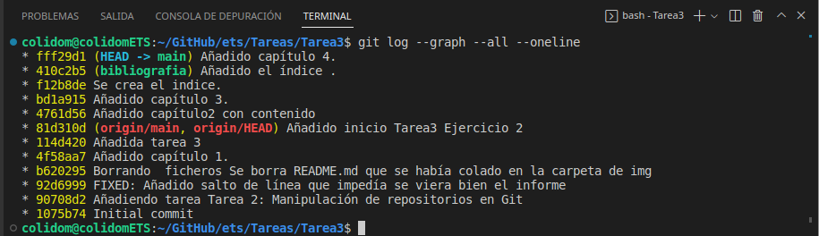

## Tarea3: Manipulación Avanzada en Git
Alumno: Carlos Javier Oliva Domínguez
N. Lista: 26

###Ejercicio 1:
#### Descripción de la tarea
- Mostrar el historial de cambios del repositorio.
- Crear la carpeta capítulos y crear dentro de ella el fichero capitulo1.txt con el siguiente texto.
    ```
    - Git es un sistema de control de versiones ideado por Linus Torvalds.
    ```
- Añadir los cambios a la zona de intercambio temporal.
- Hacer un commit de los cambios con el mensaje Añadido capítulo 1.
- Volver a mostrar el historial de cambios del repositorio.

###Resultado:
El primer paso para realizar la tarea será el clonado el repositorio propuesto por el profesor, posteriormente haremos un `git log` para comprobar el historial de cambios del repositorio.


Salida comando `git log`


Lo siguiente será crear la carpeta capítulos y crear dentro de ella el fichero capitulo1.txt con el siguiente texto:
    ```
    - Git es un sistema de control de versiones ideado por Linus Torvalds.
    ```

- El comando `mkdir` crea una carpeta en la localización en la que nos encontramos.
- El comando `echo` recoge una cadena de texto y con los operadores >> lo metemos en un fichero llamado a nuestra elección, en este caso `capítulo1.txt` tal y como se pide en la tarea.

El siguiente paso será añadirlos a la zona de intercambio temporal `stage` y hacer un commit además de añadir un mensaje descriptivo al mismo, por ejemplo `Añadido capítulo 1.`.


Una vez hecho esto, volveremos a emplear el comando `git.log` para comprobar los nuevos cambios que hemos añadido sobre nuestro repo.


Algo que es interesante destacar es que si nos fijamos en la ruta de la terminal `\Tareas\Tarea3`, estamos trabajando en un repositorio git dentro de otro repositorio git `\ets`(A elección propia con fines organizativos solamente). Lo curioso es ver como git sabe que esto es así y nos detecta cambios en ramas distintas...
Por un lado `origin/main` y por otro lado `HEAD -> main` que aunque no es una rama en si, me parece muy curioso como Git mueve ese Head al repo en el que estamos trabajando actualmente, donde hemos hecho el commit `Añadido capítulo 1`.

--- 
###Ejercicio 2:
#### Descripción de la tarea

- Crear el fichero capitulo2.txt en la carpeta capítulos con el siguiente texto.
```
El flujo de trabajo básico con Git consiste en: 1- Hacer cambios en el repositorio. 2- Añadir los cambios a la zona de intercambio temporal. 3- Hacer un commit de los cambios.
```

- Añadir los cambios a la zona de intercambio temporal.
- Hacer un commit de los cambios con el mensaje Añadido capítulo 2.
- Mostrar las diferencias entre la última versión y dos versiones anteriores.

###Resultado:

Creando el fichero y añadiendo el contenido:


Añadimos los cambios a la zona de intercambio temporal mediante el comando `git add .` (el punto "." significa que queremos añadir todos los ficheros del directorio actual).

Además de ello haremos un commit y añadiremos un mensaje al mismo tal y como se pide en la tarea, mediante el comando `git commit -m "aquí el mensaje"`. 


Ahora mediante el comando `git log` mostramos los cambios realizados sobre el fichero README.md en este caso.
`*Se están visualizando varios cambios que no se piden en la tarea pero esto es porque he ido haciendo la tarea sobre el mismo repo donde voy documentando la misma`


--- 
###Ejercicio 3:
#### Descripción de la tarea

- Crear el fichero capitulo3.txt en la carpeta capítulos con el siguiente texto.

```
Git permite la creación de ramas lo que permite tener distintas versiones del mismo proyecto y trabajar de manera simultanea en ellas.
```

- Añadir los cambios a la zona de intercambio temporal.
- Hacer un commit de los cambios con el mensaje Añadido capítulo 3.
- Mostrar las diferencias entre la primera y la última versión del repositorio.

###Resultado:

Creando el fichero y añadiendo el contenido:


Además de ello haremos un commit y añadiremos un mensaje al mismo tal y como se pide en la tarea, mediante el comando `git commit -m "aquí el mensaje"`. 


Ahora mediante el comando `git log` mostramos los cambios realizados sobre el fichero README.md en este caso.






---
###Ejercicio 4:

#### Descripción de la tarea

- Crea el fichero índice.txt la siguiente línea:

`Indice de los cápitulos, con conceptos avanzados de git`

- Añadir los cambios a la zona de intercambio temporal.
- Hacer un commit de los cambios con el mensaje "Indice de los cápitulos, con conceptos avanzados de git.
- Mostrar quién ha hecho cambios sobre el fichero indice.txt.

###Resultado:

Creando el fichero y añadiendo el contenido y luego añadimos los cambios al stage y hacemos commit con los comandos `git add .` y `git commit -m "Mensaje"`:


Finalmente, mediante el comando `git annotate indice.txt` podemos ver que usuario ha hecho cambios sobre el fichero `indice.txt`, en este caso ha sido el usuario `colidom`, es decir, **Yo!**.


---
###Ejercicio 5:

#### Descripción de la tarea
- Crear una nueva rama bibliografía y mostrar las ramas del repositorio.

###Resultado:
El primer paso será crear una rama, para ello usamos el comando git branch "nombre rama" y posteriormente con el comando `git branch -av` mostramos las ramas del repo, véase a continuación.


---
###Ejercicio 6:

#### Descripción de la tarea
- Crear el fichero capitulos/capitulo4.txt y añadir el texto siguiente:

```
En este capítulo veremos cómo usar GitHub para alojar repositorios en remoto.
```

- Añadir los cambios a la zona de intercambio temporal.
- Hacer un commit con el mensaje “Añadido capítulo 4.”
- Mostrar la historia del repositorio incluyendo todas las ramas.

###Resultado:
Creando el fichero y añadiendo el contenido:


Ahora vamos a mostrar la evolución de los commits del repositorio representado gráficamente, para ello usamos el comando `git log --graph --all --oneline`.


---
###Ejercicio 7:

#### Descripción de la tarea
- Cambiar a la rama bibliografía.
- Crear el fichero bibliografia.txt y añadir la siguiente referencia:
```
Chacon, S. and Straub, B. Pro Git. Apress.
Añadir los cambios a la zona de intercambio temporal.
```
- Hacer un commit con el mensaje “Añadida primera referencia bibliográfica.”
- Mostrar la historia del repositorio incluyendo todas las ramas.

###Resultado:
Primeramente nos moveremos a la rama **bibliografia** (`git checkout bibliografia`).
Luego añadiremos el texto propuesto en el ejercicio y haremos commit.


Ahora mostramos gráficamente el historial del repo, para ello usamos el comando `git log --graph --all --oneline`.

