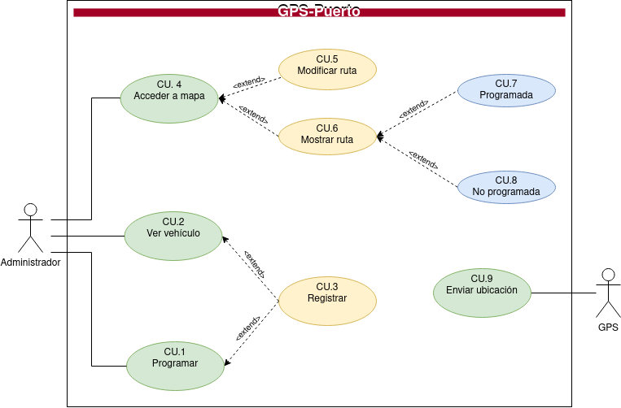

## Especificación de Casos de Uso:

  

## Índice
  - [Introducción](#introducción).
  - [Descripción](#descripción).
  - [Especificación de actores](#especificación-de-actores).
  - [Especificación de casos de uso](#especificación-de-casos-de-uso-1).

### Introducción

  El presente documento especifica el __diagrama de casos de uso__ de la aplicación __GPSPuerto__ solicitada por la empresa de transporte ubicada en Puerto de la Cruz al norte de Tenerife.

  Este documento trata a grandes rasgos, los casos de uso identificados, así como los actores que intervienen en ellos.

  

    
  

### Descripción

  Una empresa de transporte de mercancías quiere hacer una supervisión de todos los camiones de los que dispone. Para ello, se han especificado una serie de requisitos descritos en el presente documento.

### Especificación de Actores

  En el presente documento se realiza la especificación de los diferentes actores que intervienen en la solución propuesta.

#### GPS

  |  Actor | GPS |
  |---|---|
  | Descripción  | Sistema encargado del envío de la señal de gps cada 5 minutos  |
  | Características  | |
  | Relaciones |   |
  | Referencias | __Enviar ubicación__ |   
  |  Notas |   |
  | Autor  | _Carlos Oliva_ |
  |Fecha | _12/01/2023_ |

  |  Atributo |||
  |---|---|---|
  | _Nombre_  | _Descripción_  | _Tipo_ |
  | ubicación | Ubicación del vehículo | double[2] |

#### Administrador

  |  Actor | GPS |
  |---|---|
  | Descripción  | Gestor de GPSPuerto | |
  | Relaciones |   |
  | Referencias | __Elegir Vehículo, Programar Ruta, Registrar GPS, Visualizar Mapa (Vehículos Activos Vehículos Parados), Modificar Ruta , Mostrar Ruta (Programadas, No Programadas)__ |   
  |  Notas |   |
  | Autor  | _Carlos Oliva_ |
  |Fecha | _12/01/2023_ |

### Especificación de Casos de uso

#### Registrar GPS

|  Caso de Uso	CU.1 | Registrar GPS |
|---|---|
| Fuentes  |   |
| Actor  |  Administrador |
| Descripción | El administrador guarda un gps/vehículo en la aplicación. |
| Flujo básico | El administrador realiza el almacenamiento del GPS para la adjudicación de una ruta. |
| Pre-condiciones |  |  
| Post-condiciones  | |  
|  Requerimientos |  |
|  Notas |  |
| Autor  | _Carlos Oliva_ |
|Fecha | _18/01/23_ |

#### Programar Ruta

|  Caso de Uso  CU.2 | Programar Ruta |
|---|---|
| Fuentes  |   |
| Actor  |  Administrador |
| Descripción | El administrador programa unas rutas para cada transporte con una fecha/hora de salida, fecha/hora de llegada (prevista). Y de esa manera se puede conocer qué vehículos están operativos en un momento determinado. |
| Flujo básico | El administrador seleccionara un vehículo para programar la ruta adecuada. |
| Pre-condiciones | |  
| Post-condiciones  |  |  
|  Requerimientos | Se debe de realizar el __CU.1__(El vehículo debe de estar dado de alta, el vehículo debe estar disponible).|
|  Notas |  |
| Autor  | _Carlos Oliva_ |
|Fecha | _18/01/23_ |

#### Ver Vehículo

|  Caso de Uso  CU.3| Ver Vehículo |
|---|---|
| Fuentes  |   |
| Actor  |  Administrador |
| Descripción | El administrador elige el vehículo que desea visualizar |
| Flujo básico | El administrador realizara la elección de un vehículo que previamente debe estar dado de alta|
| Pre-condiciones | |  
| Post-condiciones  | |  
|  Requerimientos | Se debe de realizar el __CU.1__(El vehículo debe de estar dado de alta, el vehículo debe estar disponible). |
|  Notas |  |
| Autor  | _Carlos Oliva_ |
|Fecha | _18/01/23_ |

#### Visualizar Mapa

|  Caso de Uso	CU.4 | Acceder Mapa |
|---|---|
| Fuentes  |   |
| Actor  |  Administrador |
| Descripción | El administrador puede acceder a un mapa en el que aparecen en el mismo geolocalizados los distintos camiones. |
| Flujo básico | Escoger mapa, para modificar una ruta o mostrar una ruta específica. |
| Pre-condiciones |  |  
| Post-condiciones | |  
| Requerimientos |  |
| Notas |  |
| Autor  | _Carlos Oliva_ |
| Fecha | _18/01/23_ |

#### Modificar Ruta

|  Caso de Uso  CU.5 | Modificar Ruta  |
|---|---|
| Fuentes  |   |
| Actor  |  Administrador |
| Descripción | La aplicación permite modificar una ruta creada. |
| Flujo básico |  |
| Pre-condiciones |  |  
| Post-condiciones  |  |  
| Requerimientos |  |
| Notas |  |
| Autor  | _Carlos Oliva_ |
|Fecha | _18/01/23_ |

#### Mostrar Ruta

|  Caso de Uso  CU.6 | Mostrar Ruta  |
|---|---|
| Fuentes  |   |
| Actor  |  Administrador |
| Descripción | La aplicación permite mostrar una ruta creada. |
| Flujo básico | Seleccionar un vehículo/ruta y mostrar |
| Pre-condiciones | Seleccionar de vehículo/ruta |  
| Post-condiciones  |  |  
| Requerimientos |  |
| Notas |  |
| Autor  | _Carlos Oliva_ |
|Fecha | _18/01/23_ |

#### Mostrar Ruta Programada

|  Caso de Uso	CU.7 | Mostrar Ruta  |
|---|---|
| Fuentes  |   |
| Actor  |  Administrador |
| Descripción | La aplicación permite mostrar una ruta creada y que se encuentra programada |
| Flujo básico | Seleccionar un vehículo/ruta y mostrar la ruta programada. |
| Pre-condiciones | Seleccionar de vehículo/ruta |  
| Post-condiciones  |  |  
| Requerimientos |  |
| Notas |  |
| Autor  | _Carlos Oliva_ |
|Fecha | _18/01/23_ |

#### Mostrar Ruta No Programada

|  Caso de Uso	CU.8 | Mostrar Ruta  |
|---|---|
| Fuentes  |   |
| Actor  |  Administrador |
| Descripción | La aplicación permite mostrar una ruta creada y que se encuentra programada |
| Flujo básico | Seleccionar un vehículo/ruta y mostrar la ruta no programada. |
| Pre-condiciones | Seleccionar de vehículo/ruta |  
| Post-condiciones  |  |  
| Requerimientos |  |
| Notas |  |
| Autor  | _Carlos Oliva_ |
|Fecha | _18/01/23_ |

#### Enviar Ubicación

|  Caso de Uso	CU.9 | Enviar Ubicación |
|---|---|
| Fuentes  |   |
| Actor  |  GPS |
| Descripción | El sistema enviará su ubicación cada 5 minutos. |
| Flujo básico | El sistema debe ser automata para el envío de su ubicación |
| Pre-condiciones |  |  
| Post-condiciones  |  |  
|  Requerimientos |  |
|  Notas |  |
| Autor  | _Carlos Oliva_ |
|Fecha | _18/01/23_ |

