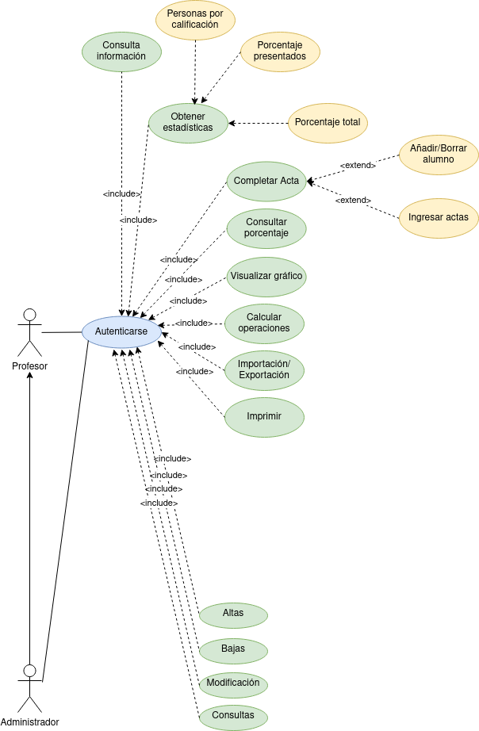

  

 

Se desea desarrollar una aplicación de gestión de las calificaciones de los alumnos para satisfacer las numerosas quejas de los profesores, por el uso del lápiz y papel. La aplicación debe de cumplir los temas que se describen a continuación: El profesor recibe las actas en blanco de las asignaturas de las que es responsable, en formato electrónico. El acta contiene los siguientes datos de la asignatura (titulación,campus, curso académico, denominación de la asignatura, convocatoria y grupo) y la lista de alumnos matriculados (niu, nif, nombre y apellidos). Alguna de las acciones que puede hacer el profesor son:

- Completar un acta con las notas de los alumnos.
- Añadir o borrar un alumno de un acta.
- Integrar las actas de varios grupos de una misma asignatura en una sola acta.
- Otras de las opciones que se le exige a la aplicación, para satisfacer completamente las necesidades del profesor, son las siguientes:
  - Permitir la consulta de la siguiente información de cualquier alumno seleccionado DNI, N.° EXPEDIENTE, Lista de asignaturas en las que está matriculado el alumno (Código asignatura-Nombre asignatura).
  - Obtener una estadística de las calificaciones obtenidas por los alumnos en un determinado grupo de una asignatura. En esta estadística se tendrá para cada posible calificación:
  - Número de personas con esa calificación, Porcentaje sobre los presentados, Porcentaje sobre el total del grupo.
  - Consultar el porcentaje de personas sobre el total del grupo que se han presentado y el de los que no se han presentado.
  - Poder visualizar un gráfico indicativo del número de personas que han obtenido una calificación entre 0-0.99, 1-1.99, 2-2.99, 3-3.99, 4-4.99, 5-5.99, 6-6.99, 8-8.99, 9-10; indicándose la nota media obtenida por la clase.
  - Disponer de una calculadora que permita realizar las operaciones de suma, resta, multiplicación, división. Esta calculadora se activará cuando se vayan a introducir las notas a algún alumno de forma que una vez realizada la operación aritmética, pulsando un botón se vuelque el resultado en la casilla donde se están introduciendo las calificaciones, redondeándose a dos cifras decimales.
  - Permitir la importación y exportación de la lista de alumnos con sus calificaciones a un formato compatible con MS Excel.
  - Imprimir las actas y la lista provisional de calificaciones.

Finalmente, como una ampliación extra, a la cual sólo podrá acceder quien se identifique inicialmente como administrador de la aplicación, se deben permitir:

  - CRUD (Altas/Bajas/Modificación y Consulta) para cada uno de los siguientes grupos:.
    - Asignaturas, teniendo en cuenta que una asignatura sólo se puede dar en un único curso (primero, segundo, tercero...) y que cada curso está formado ponlos datos sobre el número máximo de alumnos, número mínimo de créditos troncales y número mínimo de créditos optativos. Algunos de los datos que vamos a poder consultar de una asignatura son el nombre, número de créditos y cuatrimestre en el que se imparte.
    - Titulaciones, teniendo en cuenta que una titulación sólo se da en un campus determinado y los datos que podemos consultar son el nombre, el número de créditos o carga lectiva global, si es de 1.° o 2.' ciclo, ...
    - Grupos, en los que podemos consultar el número máximo de alumnos permitidos, si es un grupo de mañana, de tarde o de noche, y cuál es el código empleado para identificar el grupo.
    - Alumnos:
      - Consultar aquellos alumnos que no se pueden matricular y el motivo de ello.
      - Consultar el historial académico de un alumno.

Realiza:
-   Identifica los actores.
-   Identifica los **CU** de cada uno de los actores.
-   Realiza el diagrama de CU.

  

## Especificación de Casos de Uso:

## Índice

-   [Introducción](#introducción).
-   [Descripción](#descripción).
-   [Especificación de actores](#especificación-de-actores).
-   [Especificación de casos de uso](#especificación-de-casos-de-uso-1).

### Introducción

El presente documento especifica el **diagrama de casos de uso** de la aplicación **Gestion Profesores**.

Este documento trata a grandes rasgos, los casos de uso identificados, así como los actores que intervienen en ellos.

### Descripción

El objetivo es realizar un sistema para gestionar las cuentas de los Profesors que realizan pedidos de productos del negocio.

### Especificación de Actores

En el presente documento se realiza la especificación de los diferentes actores que intervienen en la solución propuesta.

#### Profesor

| Profesor        | Profesor                     |
| --------------- | ---------------------------- |
| Descripción     | El profesor recibe las actas en blanco de las asignaturas de las que es responsable, en formato electrónico              |
| Características |  El profesor se debe autenticar en el sistema |
| Relaciones      |                              |
| Referencias     |                              |
| Notas           |                              |
| Autor           | _Carlos Oliva_               |
| Fecha           | _30/01/2023_                 |

#### Administrador

| Administrador   | Administrador                |
| --------------- | ---------------------------------------------------------------------- |
| Descripción     | Administrador del sistema, puede hacer CRUD  |
| Características | Puede dar de alta, baja, modificar y consultar Asignaturas,Titulaciones, Grupos y Alumnos                                                                  |
| Relaciones      |                                                                        |
| Referencias     |                                                                        |
| Notas           |                                                                        |
| Autor           | _Carlos Oliva_                                                         |
| Fecha           | _30/01/2023_                                                           |

### Especificación de Casos de uso

#### Gestionar actas

| Caso de Uso CU.1 |  Gestionar actas |
| ---------------- | ------------------------------------------------------------------------------------------------------------------------------------------------ |
| Fuentes          | El caso de uso se sustenta en [este documento](https://github.com/jpexposito/ets/tree/main/diagramas-comportamiento/diagramas-cu/tareas/tarea7). |
| Actor            | Profesor                                                                                                                                        |
| Descripción      |  Profesor puede gestionar actas                                                                                                                |
| Flujo básico             | Profesor se autentica y puede gestionar actas                                                                                                                                               |
| Pre-condiciones  | Estar autenticado                                                                                                                                                 |
| Post-condiciones |                                                                                                                                                  |
| Requerimientos   |                                                                                                                                                  |
| Notas            |                                                                                                                                                  |
| Autor            | _Carlos Oliva_                                                                                                                                   |
| Fecha            | _20/01/23_                                                                                                                                       |

#### Obtener estadísticas

|Caso de Uso CU.2  |  Obtener estadísticas       |
| ---------------- | ------------------------------------------------------------------------------------------------------------------------------------------------ |
| Fuentes          | El caso de uso se sustenta en [este documento](https://github.com/jpexposito/ets/tree/main/diagramas-comportamiento/diagramas-cu/tareas/tarea7). |
| Actor            | Profesor                                                                                                                                          |
| Descripción      |  Obtener una estadística de las calificaciones obtenidas por los alumnos en un determinado grupo de una asignatura                                                                                                       |
| Flujo básico     |                                                                                                                                                  |
| Pre-condiciones  |                                                                                                                                                  |
| Post-condiciones |                                                                                                                                                  |
| Requerimientos   |                                                                                                                                                  |
| Notas            |                                                                                                                                                  |
| Autor            | _Carlos Oliva_                                                                                                                                   |
| Fecha            | _20/01/23_                                                                                                                                       |

#### Personas por calificación

| Caso de Uso CU.3    |  Personas por calificación     |
| ---------------- | ------------------------------------------------------------------------------------------------------------------------------------------------ |
| Fuentes          | El caso de uso se sustenta en [este documento](https://github.com/jpexposito/ets/tree/main/diagramas-comportamiento/diagramas-cu/tareas/tarea7). |
| Actor            | Profesor                                                                                                                                          |
| Descripción        |  Obtener estadística de número de personas con cada calificación                                                                                                  |
| Flujo básico     |                                                                                                                                                  |
| Pre-condiciones  |                                                                                                                                                  |
| Post-condiciones |                                                                                                                                                  |
| Requerimientos   |                                                                                                                                                  |
| Notas            |                                                                                                                                                  |
| Autor            | _Carlos Oliva_                                                                                                                                   |
| Fecha            | _20/01/23_                                                                                                                                       |

#### Porcentaje presentados

|Caso de Uso CU.4 |Caso de Porcentaje presentados                            |
| ---------------- | ------------------------------------------------------- |
| Fuentes          | El caso de uso se sustenta en [este documento](https://github.com/jpexposito/ets/tree/main/diagramas-comportamiento/diagramas-cu/tareas/tarea7).          |
| Actor            |Profesor                                                 |
| Descripción      | Obtener estadística de porcentaje sobre los presentados |
| Flujo básico     |                                                         |
| Pre-condiciones  |                                                         |
| Post-condiciones |                                                         |
| Requerimientos   |                                                         |
| Notas            |                                                         |
| Autor            | _Carlos Oliva_                                          |
| Fecha            | _20/01/23_                                              |

#### Porcentaje total

| Caso de Uso CU.5 |Porcentaje total                                |
| ---------------- | ---------------------------------------------- |
| Fuentes          | El caso de uso se sustenta en [este documento](https://github.com/jpexposito/ets/tree/main/diagramas-comportamiento/diagramas-cu/tareas/tarea7). |
| Actor            | Profesor                                       |
| Descripción      | Obtener estadística de porcentaje sobre el total 
del grupo                                                           |
| Flujo básico     |                                                |
| Pre-condiciones  |                                                |
| Post-condiciones |                                                |
| Requerimientos   |                                                |
| Notas            |                                                |
| Autor            | _Carlos Oliva_                                 |
| Fecha            | _20/01/23_                                     |

#### Imprimir

| Caso de Uso CU.6 | Imprimir  |
| ---------------- | ---------------------------------------------- |
| Fuentes          | El caso de uso se sustenta en [este documento](https://github.com/jpexposito/ets/tree/main/diagramas-comportamiento/diagramas-cu/tareas/tarea7). |
| Actor            | Profesor                                       |
| Descripción      | El profesor puede imprimir las actas y la lista provisional de calificaciones |
| Flujo básico     |                                                |
| Pre-condiciones  |                                                |
| Post-condiciones |                                                |
| Requerimientos   |                                                |
| Notas            |                                                |
| Autor            | _Carlos Oliva_                                 |
| Fecha            | _20/01/23_                                     |

#### Consulta información  

| Caso de Uso CU.7 | Consulta información                                                                                                                    |
| ---------------- | ---------------------------------------------- |
| Fuentes          | El caso de uso se sustenta en [este documento](https://github.com/jpexposito/ets/tree/main/diagramas-comportamiento/diagramas-cu/tareas/tarea7). |
| Actor            | Profesor                                       |
| Descripción      | Permitir la consulta de la siguiente información de cualquier alumno seleccionado DNI, N.° EXPEDIENTE, Lista de asignaturas en las que está matriculado el alumno (Código asignatura-Nombre asignatura)                               |
| Flujo básico     |                                                |
| Pre-condiciones  |                                                |
| Post-condiciones |                                                |
| Requerimientos   |                                                |
Notas              |                                                |
| Autor            | _Carlos Oliva_                                 |
| Fecha            | _20/01/23_                                     |

#### Consultar porcentaje    

| Caso de Uso CU.8 | Consultar porcentaje                                                          |
| ---------------- | ---------------------------------------------- |
| Fuentes          | El caso de uso se sustenta en [este documento](https://github.com/jpexposito/ets/tree/main/diagramas-comportamiento/diagramas-cu/tareas/tarea7). |
| Actor            | Profesor                                       |
| Descripción      | Consultar el porcentaje de personas sobre el total del grupo que se han presentado y el de los que no se han presentado                     |
| Flujo básico     |                                                |
|Pre-condiciones   |                                                |
| Post-condiciones |                                                |
| Requerimientos   |                                                |
| Autor            | _Carlos Oliva_                                 |
| Fecha            | _20/01/23_                                     |

#### Visualizar gráfico

| Caso de Uso CU.9 | Visualizar gráfico                             |
| ---------------- | ---------------------------------------------- |
| Fuentes          | El caso de uso se sustenta en [este documento](https://github.com/jpexposito/ets/tree/main/diagramas-comportamiento/diagramas-cu/tareas/tarea7). |
| Actor            | Sistema                                        |
| Descripción      | Poder visualizar un gráfico indicativo del número de personas que han obtenido una calificación entre 0-0.99, 1-1.99, 2-2.99, 3-3.99, 4-4.99, 5-5.99, 6-6.99, 8-8.99, 9-10; indicándose la nota media obtenida por la clase               |
| Flujo básico     |                                                |
| Pre-condiciones  |                                                |
| Post-condiciones |                                                |
| Requerimientos   |                                                |
| Notas            |                                                |
| Autor            | _Carlos Oliva_                                 |
| Fecha            | _20/01/23_                                     |

#### Caso uso 10

| Caso de Uso CU.10 | Caso uso 10                                                                                                                                                                 |
| ----------------- | ------------------------------------------------------------------------------------------------------------------------------------------------------------------------------- |
| Fuentes           | El caso de uso se sustenta en [este documento](https://github.com/jpexposito/ets/tree/main/diagramas-comportamiento/diagramas-cu/tareas/tarea7).                                |
| Actor             | Sistema                                                                                                                                                                         |
| Descripción       |  |
| Flujo básico      |                                                                                                                                                                                 |
| Pre-condiciones   |                                                                                                                                                                                 |
| Post-condiciones  |                                                                                                                                                                                 |
| Requerimientos    |                                                                                                                                                                                 |
| Notas             |                                                                                                                                                                                 |
| Autor             | _Carlos Oliva_                                                                                                                                                                  |
| Fecha             | _20/01/23_                                                                                                                                                                      |

#### CAso uso 11

| Caso de Uso CU.11 | CAso uso 11                                                                                                                                     |
| ----------------- | ------------------------------------------------------------------------------------------------------------------------------------------------ |
| Fuentes           | El caso de uso se sustenta en [este documento](https://github.com/jpexposito/ets/tree/main/diagramas-comportamiento/diagramas-cu/tareas/tarea7). |
| Actor             | Sistema                                                                                                                                          |
| Descripción       |                                                                                                     |
| Flujo básico      |                                                                                                                                                  |
| Pre-condiciones   |                                                                                                                          |
| Post-condiciones  |                                                                                                                                                  |
| Requerimientos    |                                                                                                                                                  |
| Notas             |                                                                                                                                                  |
| Autor             | _Carlos Oliva_                                                                                                                                   |
| Fecha             | _20/01/23_                                                                                                                                       |

#### Caso uso 12

| Caso de Uso CU.12 | Caso uso 12                                                                                                                                |
| ----------------- | ------------------------------------------------------------------------------------------------------------------------------------------------ |
| Fuentes           | El caso de uso se sustenta en [este documento](https://github.com/jpexposito/ets/tree/main/diagramas-comportamiento/diagramas-cu/tareas/tarea7). |
| Actor             | Actor                                                                                                                                          |
| Descripción       |                                                                                                                                                  |
| Flujo básico      |                                                                                                                                                  |
| Pre-condiciones   |                                                                                                                                |
| Post-condiciones  |                                                                                                                                                  |
| Requerimientos    |                                                                                                                                                  |
| Notas             |                                                                                                                                                  |
| Autor             | _Carlos Oliva_                                                                                                                                   |
| Fecha             | _20/01/23_                                                                                                                                       |

