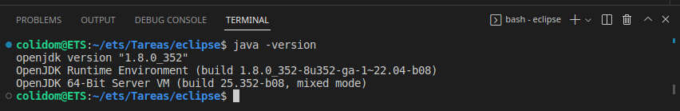
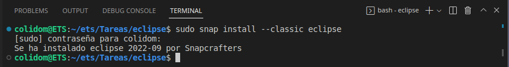
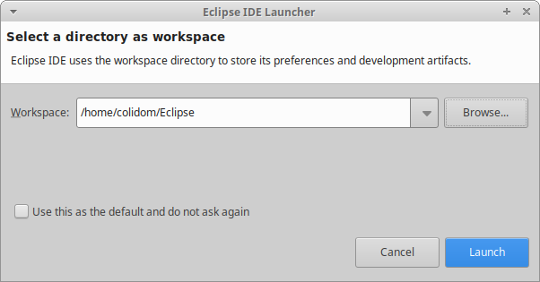
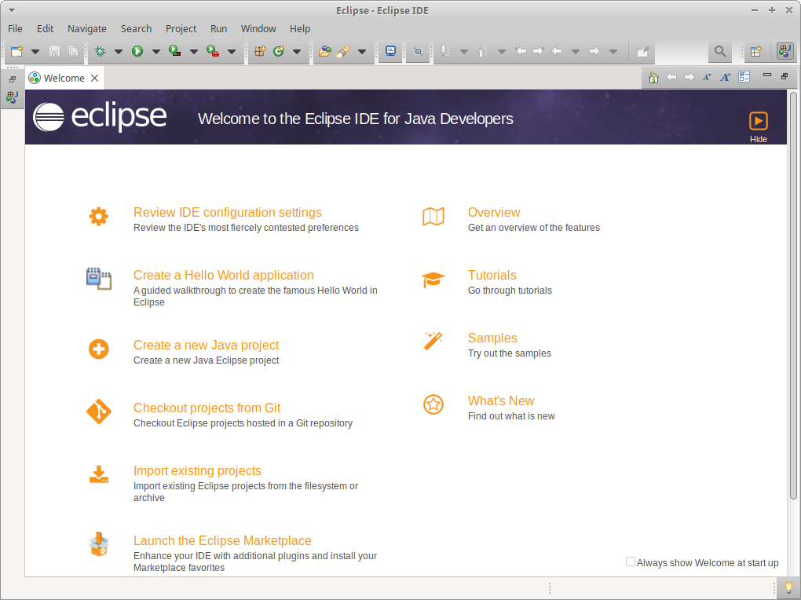

## Tarea: Instalación del IDE Eclipse
Alumno: Carlos Javier Oliva Domínguez
N. Lista: 26

**Índice**

1. [Prerrequisitos](#id1)
2. [Instalación](#id2)
3. [Lanzamiento de Eclipse](#id3)

---

##### Prerrequisitos <a name="id1"></a>
Primeramente comprobaremos que tenemos correctamente instalado Java en nuestro sistema:



##### Instalación <a name="id2"></a>
Mediante el siguiente comando vamos a instalar Eclipse en nuestro sistema:
```
sudo snap install --classic eclipse
```


##### Lanzamiento de Eclipse <a name="id3"></a>
AHora buscaremos eclipse en el sistema y lo ejecutaremos, veremos que aparece en la pantalla lo siguiente:


Nos preguntará donde queremos configurar nuestro espacio de trabajo o workspace


Finalmente se abrirá una ventana de bienvenida de Eclipse en la que podremos elegir varias opciones

