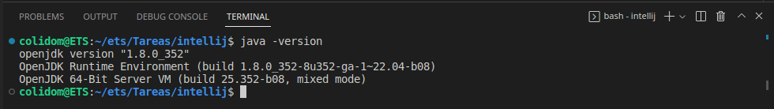
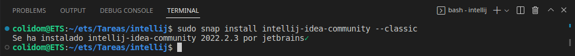

## Tarea: Instalación del IDE Eclipse
Alumno: Carlos Javier Oliva Domínguez
N. Lista: 26

**Índice**

1. [Prerrequisitos](#id1)
2. [Instalación](#id2)
3. [Lanzamiento de IntelliJ](#id3)

---

##### Prerrequisitos <a name="id1"></a>
Primeramente comprobaremos que tenemos correctamente instalado Java en nuestro sistema:



##### Instalación <a name="id2"></a>
Mediante el siguiente comando vamos a instalar IntelliJ IDEA en nuestro sistema:
```
sudo snap install intellij-idea-community --classic
```


##### Lanzamiento de IntelliJ <a name="id3"></a>
AHora buscaremos IntelliJ IDEA en el sistema y lo ejecutaremos, veremos que aparece en la pantalla lo siguiente:


FInalmente cuando acabe de cargar nos abrirá una ventana de bienvenida en la que podremos realizar varias acciones antes de empezar a trabajar


