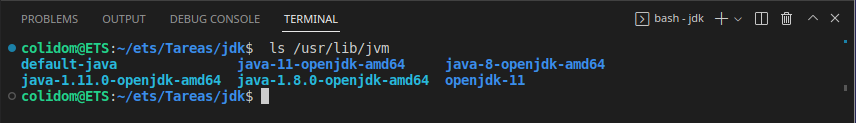

## Tarea: Instalación de JDK en el SO
Alumno: Carlos Javier Oliva Domínguez
N. Lista: 26

##### ¿Cómo instalar Java en Ubuntu desde repositorios?
Lo primero debemos de actualizar el sistema con el comando:
```
sudo apt-get update
```


Luego instalaremos Java con el siguiente comando:
```
sudo apt-get install default-jdk
```


Comprobamos que el jdk se ha instalado correctamente mostrando su versión, en mi caso será la `11.0.17`.
```
java --version
```


##### Configuración de las variables de entorno
Listaremos la versiones de OpenJDK instaladas en el sistema mediante el comando:
```
ls /usr/lib/jvm
```
En mi caso es OpenSDK 11 como se puede ver en la captura siguiente:


##### Actualización de las variables de entorno
El siguiente comando indica 
````
sudo update-alternatives --config java
````
