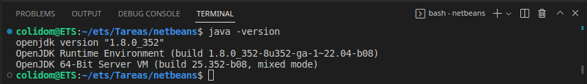
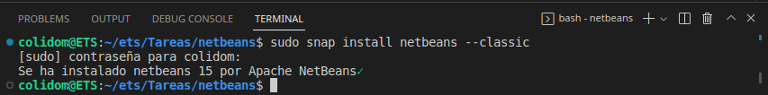
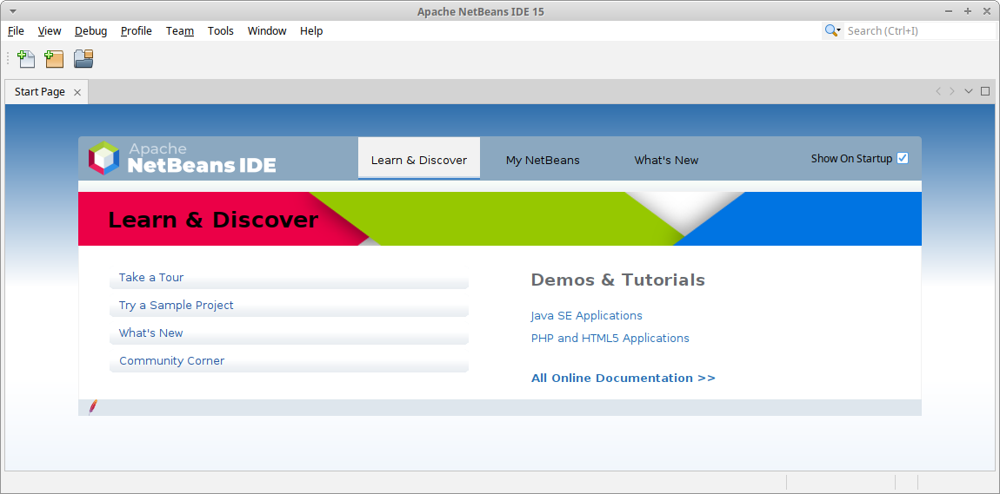
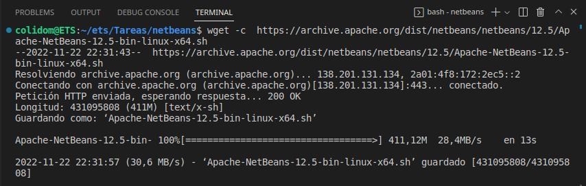
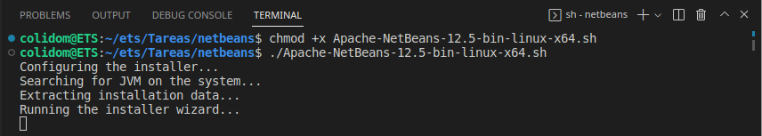
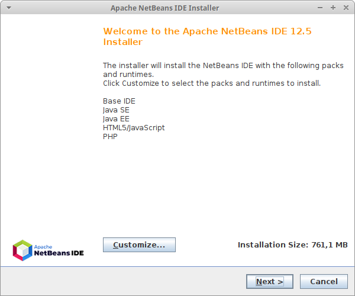
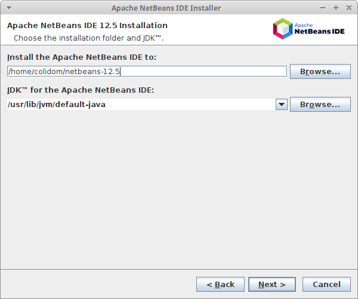
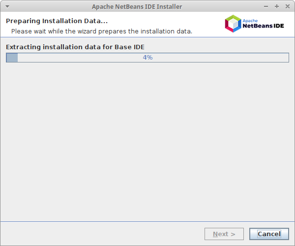
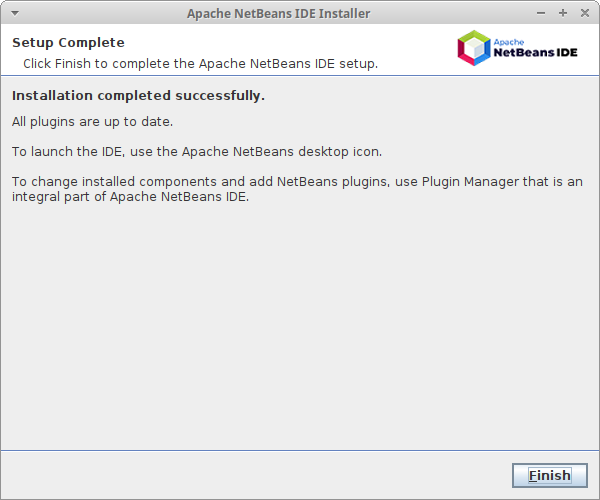

## Tarea: Instalación del IDE Netbeans 12
Alumno: Carlos Javier Oliva Domínguez
N. Lista: 26

**Índice**

1. [Prerrequisitos](#id1)
2. [Instalación](#id2)
3. [Ejecutando Netbeans 15](#id3)
4. [Eliminar Netbeans](#id4)
5. [Instalación a través wget (Cualquier distribución Linux)](#id5)

---

##### Prerrequisitos <a name="id1"></a>
Primeramente comprobaremos que tenemos correctamente instalado Java en nuestro sistema:



##### Instalación <a name="id2"></a>
Ahora instalaremos Netbeans mediante el siguiente comando:
```
sudo snap install netbeans --classic
```



##### Ejecutando Netbeans 15<a name="id3"></a>
Una vez instaldo podremos abrir el IDE y comprobamos su interfaz de bienvenida




##### Eliminar Netbeans <a name="id4"></a>
Aunque no haremos este pasi, en caos de querer eliminar Netbeans usaremos el comando:

```
sudo snap remove netbeans
```

##### Instalación a través wget (Cualquier distribución Linux) <a name="id5"></a>

Ahora vamos a  realizar la instalación de `Netbeans 12.5` a través del comando `wget`.


Otorgamos permisos de ejecución y lo ejecutamos


Ahora nos aparecerá el Asistente de instalación que tendrá el siguiente aspecto:

Haremos click en `Next`



Dejaremos por defecto la ruta donde se instalará Netbeans y haremos click en `Next`


Nos aparecerá la siguiente pantalla y tendremos que esperar a que finalize el proceso.


Finalmente podremos comprobar que la instalación ha finalizado correctamente.

