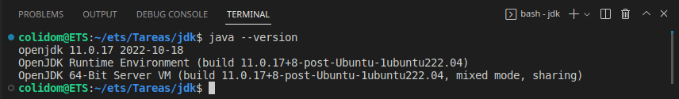
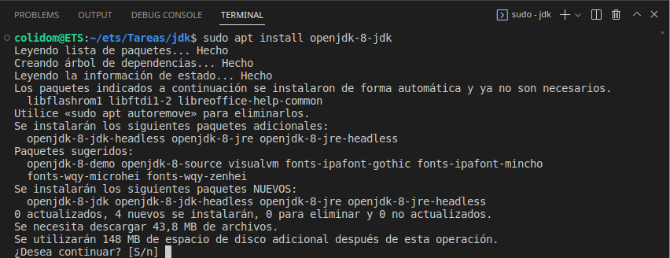
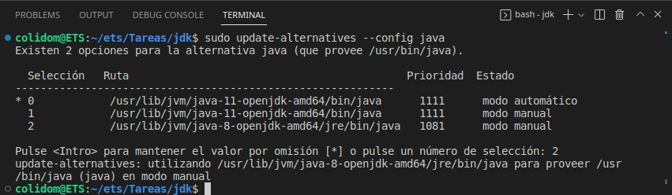
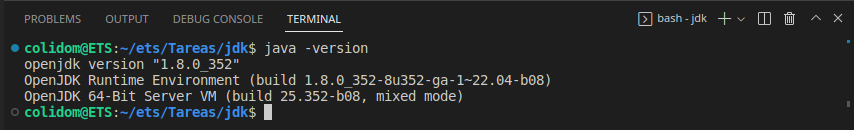

## Tarea: Instalación de JDK en el SO
Alumno: Carlos Javier Oliva Domínguez
N. Lista: 26

**Índice**

1. [¿Cómo instalar Java en Ubuntu desde repositorios?](#id1)
2. [¿Cómo instalar una versión específica de Java?](#id2)
3. [Configuración de las variables de entorno](#id3)
4. [Actualización de las variables de entorno](#id4)

---

##### ¿Cómo instalar Java en Ubuntu desde repositorios? <a name="id1"></a>
Lo primero debemos de actualizar el sistema con el comando:
```
sudo apt-get update
```


Luego instalaremos Java con el siguiente comando:
```
sudo apt-get install default-jdk
```


Comprobamos que el jdk se ha instalado correctamente mostrando su versión, en mi caso será la `11.0.17`.
```
java --version
```


##### ¿Cómo instalar una versión específica de Java? <a name="id2"></a>
Dado que en esta tarea se indica que usaremos la versión 8 del JDK vamos a instalarla para ello usamos:
```
sudo apt install openjdk-8-jdk
```


##### Configuración de las variables de entorno <a name="id3"></a>
Listaremos la versiones de OpenJDK instaladas en el sistema mediante el comando:
```
ls /usr/lib/jvm
```
En mi caso es OpenSDK 8 y 11 como se puede ver en la captura siguiente:


##### Actualización de las variables de entorno <a name="id4"></a>
Con el siguiente comando podremos elegir básicamente la versión de Java con la que vamos a trabajar, en mi caso y como se requiere en la tarea será Java 8.
````
sudo update-alternatives --config java
````


Volvemos a comprobar la versión de Java pero esta vez con el comando `java -version` dado que hemos elegido la versión 8 y este es el comando de esta versión para mostrar versión.

