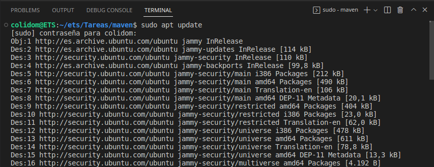
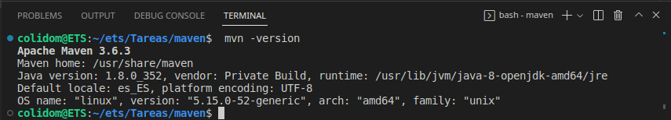
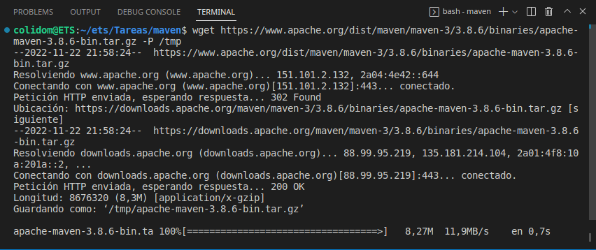
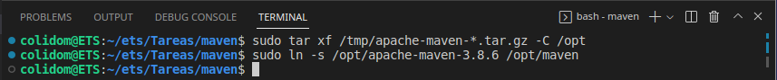
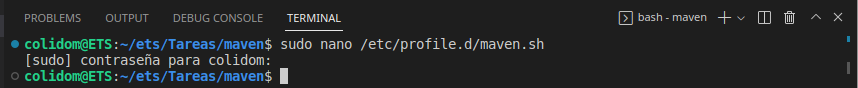
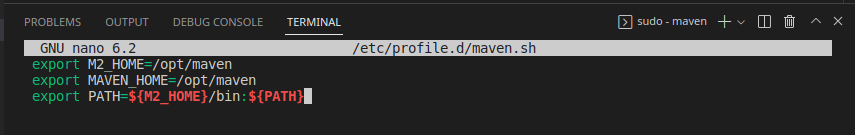
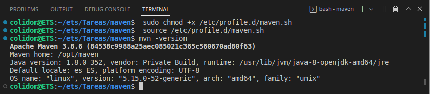

## Tarea: Instalación de Maven en el SO
Alumno: Carlos Javier Oliva Domínguez
N. Lista: 26

**Índice**

1. [Instalar Apache Maven con apt](#id1)
2. [Instalar una versión concreta de Apache Maven](#id2)


---

##### Instalar Apache Maven con apt <a name="id1"></a>
Primeramente actualizamos el índice del paquete e instalaremos Maven ingresando los siguientes comandos:

Update:
```
 sudo apt update
```


Install Maven:
```
 sudo apt install maven
```


Verificamos la versión y vemos que es la `3.6.3` pero queremos poner la última que haya salido.


##### Instalar una versión concreta de Apache Maven <a name="id2"></a>
Lo primero que haremos será dirigirnos a la web de apache y comprobar la última versión lanzada, en mi caso y en el momento de hacer este informe es la `3.8.6` por lo que la vamos a descargar en nuestro local en el directorio temporal `/tmp`.


Una vez descargada, vamos a descomprimirla por ejemplo en la ruta `/opt`.
Además a modo de tener más control sobre las versiones y actualizaciones de Maven, crearemos un  enlace simbólico que apunte al directorio de instalación de Maven mediante el comando:
```
sudo ln -s /opt/apache-maven-3.8.6 /opt/maven
```


Lo siguiente será establecer las variables de entorno por lo que crearemos un nuevo archivo llamado mavenenv.sh en el directorio /etc/profile.d/



Y ponemos el siguiente código:
```
 export M2_HOME=/opt/maven
 export MAVEN_HOME=/opt/maven
 export PATH=${M2_HOME}/bin:${PATH}
```


Una vez guardados los cambios con `ctrl + O` cerramos el fichero con `ctrl + X`.

Finalmente, el script `maven.sh` para que pueda ser ejecutado tenemos que darle permisos de ejecución para ello usaremos el comando:
```
sudo chmod +x /etc/profile.d/maven.sh
```
Seguidamente cargaremos las variables de entorno con el comando 
```
 source /etc/profile.d/maven.sh
```
Y para terminar volvemos a comprobar la versión y veremos que ya tenemos en nuestro sistema la `3.8.6`.
```
mvn -version
```
El resultado es el siguiente:

