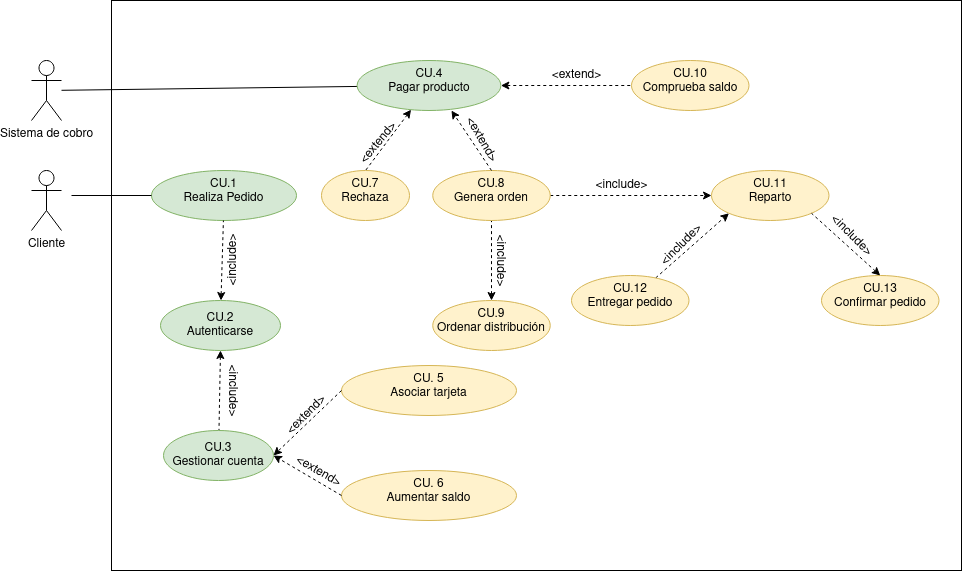

  

 

El sistema tendrá que gestionar las cuentas de los clientes que realizan pedidos de productos del negocio. Cada producto tiene un stock determinado. Generalmente un cliente tiene una o varias cuentas para pagar los pedidos y cada cuenta tiene asociada una tarjeta de crédito con una cantidad disponible de dinero. Esa cantidad puede aumentarse por parte del cliente para poder realizar más pedidos.

Los clientes que quieran realizar un pedido tendrán que tener alguna cuenta con saldo disponible.

Los pedidos pueden ser simples o compuestos. Un pedido simple solamente tendrá una cuenta de pago y como mucho tendrá 20 productos.

Un pedido compuesto puede tener dos o más pedidos (simples o compuestos). Obviamente un pedido compuesto se tiene que pagar con la cuenta de un mismo cliente.

Solamente se pueden pedir productos que estén en stock.

Los cobros se hacen diariamente a las 23:59 horas. En ese procedimiento de cobro se comprueban todos los pedidos pendientes de cobro y se cobran de las cuentas de los clientes. Si una cuenta de cliente NO tiene dinero suficiente se RECHAZA el pedido (tanto si es simple como si forma parte de un pedido compuesto).

Una vez superado este proceso se genera la orden de distribución y confirma los pedidos.

Los pedidos listos de reparto se entregan y una vez entregados su estado pasa a estar confirmado.

`Nota. Un cliente puede o no registrado previamente, con lo cual la realización de pedidos supuno realizar un registro, para más tarde autenticarse.`

Realiza:

-   Identifica los actores.
-   Identifica los **CU** de cada uno de los actores.
-   Realiza el diagrama de CU.

  

## Especificación de Casos de Uso:

## Índice

-   [Introducción](#introducción).
-   [Descripción](#descripción).
-   [Especificación de actores](#especificación-de-actores).
-   [Especificación de casos de uso](#especificación-de-casos-de-uso-1).

### Introducción

El presente documento especifica el **diagrama de casos de uso** de la aplicación **Tienda Virtual**.

Este documento trata a grandes rasgos, los casos de uso identificados, así como los actores que intervienen en ellos.

### Descripción

El objetivo es realizar un sistema para gestionar las cuentas de los clientes que realizan pedidos de productos del negocio.

### Especificación de Actores

En el presente documento se realiza la especificación de los diferentes actores que intervienen en la solución propuesta.

#### Cliente

| Actor           | Cliente                      |
| --------------- | ---------------------------- |
| Descripción     | Realiza pedidos en la tienda |
| Características |                              |
| Relaciones      |                              |
| Referencias     |                              |
| Notas           |                              |
| Autor           | _Carlos Oliva_               |
| Fecha           | _19/01/2023_                 |

#### Sistema

| Actor           | Sistema                                                                |
| --------------- | ---------------------------------------------------------------------- |
| Descripción     | Comprueba estado de pedidos, el saldo, genera orden y confirma entrega |
| Características |                                                                        |
| Relaciones      |                                                                        |
| Referencias     |                                                                        |
| Notas           |                                                                        |
| Autor           | _Carlos Oliva_                                                         |
| Fecha           | _19/01/2023_                                                           |

### Especificación de Casos de uso

#### Realizar pedido

| Caso de Uso CU.1 | Realizar pedido                                                                                                                                  |
| ---------------- | ------------------------------------------------------------------------------------------------------------------------------------------------ |
| Fuentes          | El caso de uso se sustenta en [este documento](https://github.com/jpexposito/ets/tree/main/diagramas-comportamiento/diagramas-cu/tareas/tarea6). |
| Actor            | Cliente                                                                                                                                          |
| Descripción      | El cliente hace pedidos                                                                                                                          |
| Flujo básico     |                                                                                                                                                  |
| Pre-condiciones  |                                                                                                                                                  |
| Post-condiciones |                                                                                                                                                  |
| Requerimientos   |                                                                                                                                                  |
| Notas            |                                                                                                                                                  |
| Autor            | _Carlos Oliva_                                                                                                                                   |
| Fecha            | _20/01/23_                                                                                                                                       |

#### Autenticarse

| Caso de Uso CU.2 | Autenticarse                                                                                                                                     |
| ---------------- | ------------------------------------------------------------------------------------------------------------------------------------------------ |
| Fuentes          | El caso de uso se sustenta en [este documento](https://github.com/jpexposito/ets/tree/main/diagramas-comportamiento/diagramas-cu/tareas/tarea6). |
| Actor            | Cliente                                                                                                                                          |
| Descripción      | Cliente tiene que autenticarse para pagar                                                                                                        |
| Flujo básico     |                                                                                                                                                  |
| Pre-condiciones  |                                                                                                                                                  |
| Post-condiciones |                                                                                                                                                  |
| Requerimientos   |                                                                                                                                                  |
| Notas            |                                                                                                                                                  |
| Autor            | _Carlos Oliva_                                                                                                                                   |
| Fecha            | _20/01/23_                                                                                                                                       |

#### Registrarse

| Caso de Uso CU.3 | Registrarse                                                                                                                                      |
| ---------------- | ------------------------------------------------------------------------------------------------------------------------------------------------ |
| Fuentes          | El caso de uso se sustenta en [este documento](https://github.com/jpexposito/ets/tree/main/diagramas-comportamiento/diagramas-cu/tareas/tarea6). |
| Actor            | Cliente                                                                                                                                          |
| Descripción      | Cliente se registra para realizar un pedido                                                                                                      |
| Flujo básico     |                                                                                                                                                  |
| Pre-condiciones  |                                                                                                                                                  |
| Post-condiciones |                                                                                                                                                  |
| Requerimientos   |                                                                                                                                                  |
| Notas            |                                                                                                                                                  |
| Autor            | _Carlos Oliva_                                                                                                                                   |
| Fecha            | _20/01/23_                                                                                                                                       |

#### Gestionar cuenta

| Caso de Uso CU.4 | Gestionar cuenta                                                                                                                                                                                                                                         |
| ---------------- | -------------------------------------------------------------------------------------------------------------------------------------------------------------------------------------------------------------------------------------------------------- |
| Fuentes          | El caso de uso se sustenta en [este documento](https://github.com/jpexposito/ets/tree/main/diagramas-comportamiento/diagramas-cu/tareas/tarea6).                                                                                                         |
| Actor            | Cliente                                                                                                                                                                                                                                                  |
| Descripción      | Generalmente un cliente tiene una o varias cuentas para pagar los pedidos y cada cuenta tiene asociada una tarjeta de crédito con una cantidad disponible de dinero. Esa cantidad puede aumentarse por parte del cliente para poder realizar más pedidos |
| Flujo básico     |                                                                                                                                                                                                                                                          |
| Pre-condiciones  |                                                                                                                                                                                                                                                          |
| Post-condiciones |                                                                                                                                                                                                                                                          |
| Requerimientos   |                                                                                                                                                                                                                                                          |
| Notas            |                                                                                                                                                                                                                                                          |
| Autor            | _Carlos Oliva_                                                                                                                                                                                                                                           |
| Fecha            | _20/01/23_                                                                                                                                                                                                                                               |

#### Simple

| Caso de Uso CU.5 | Simple                                                                                                                                           |
| ---------------- | ------------------------------------------------------------------------------------------------------------------------------------------------ |
| Fuentes          | El caso de uso se sustenta en [este documento](https://github.com/jpexposito/ets/tree/main/diagramas-comportamiento/diagramas-cu/tareas/tarea6). |
| Actor            | Cliente                                                                                                                                          |
| Descripción      | Un pedido compuesto puede tener dos o más pedidos (simples o compuestos)                                                                         |
| Flujo básico     |                                                                                                                                                  |
| Pre-condiciones  |                                                                                                                                                  |
| Post-condiciones |                                                                                                                                                  |
| Requerimientos   |                                                                                                                                                  |
| Notas            |                                                                                                                                                  |
| Autor            | _Carlos Oliva_                                                                                                                                   |
| Fecha            | _20/01/23_                                                                                                                                       |

#### Compuesto

| Caso de Uso CU.6 | Compuesto                                                                                                                                        |
| ---------------- | ------------------------------------------------------------------------------------------------------------------------------------------------ |
| Fuentes          | El caso de uso se sustenta en [este documento](https://github.com/jpexposito/ets/tree/main/diagramas-comportamiento/diagramas-cu/tareas/tarea6). |
| Actor            | Cliente                                                                                                                                          |
| Descripción      | Un pedido compuesto se tiene que pagar con la cuenta de un mismo cliente.                                                                        |
| Flujo básico     |                                                                                                                                                  |
| Pre-condiciones  |                                                                                                                                                  |
| Post-condiciones |                                                                                                                                                  |
| Requerimientos   |                                                                                                                                                  |
| Notas            |                                                                                                                                                  |
| Autor            | _Carlos Oliva_                                                                                                                                   |
| Fecha            | _20/01/23_                                                                                                                                       |

#### Asociar tarjeta

| Caso de Uso CU.7 | Asociar tarjeta                                                                                                                                  |
| ---------------- | ------------------------------------------------------------------------------------------------------------------------------------------------ |
| Fuentes          | El caso de uso se sustenta en [este documento](https://github.com/jpexposito/ets/tree/main/diagramas-comportamiento/diagramas-cu/tareas/tarea6). |
| Actor            | Cliente                                                                                                                                          |
| Descripción      | Cada cuenta tiene asociada una tarjeta de crédito con una cantidad disponible de dinero                                                          |
| Flujo básico     |                                                                                                                                                  |
| Pre-condiciones  |                                                                                                                                                  |
| Post-condiciones |                                                                                                                                                  |
| Requerimientos   |                                                                                                                                                  |
| Notas            |                                                                                                                                                  |
| Autor            | _Carlos Oliva_                                                                                                                                   |
| Fecha            | _20/01/23_                                                                                                                                       |

#### Aumentar saldo

| Caso de Uso CU.8 | Aumentar saldo                                                                                                                                   |
| ---------------- | ------------------------------------------------------------------------------------------------------------------------------------------------ |
| Fuentes          | El caso de uso se sustenta en [este documento](https://github.com/jpexposito/ets/tree/main/diagramas-comportamiento/diagramas-cu/tareas/tarea6). |
| Actor            | Cliente                                                                                                                                          |
| Descripción      | La cantidad puede aumentarse por parte del cliente para poder realizar más pedidos.                                                              |
| Flujo básico     |                                                                                                                                                  |
| Pre-condiciones  |                                                                                                                                                  |
| Post-condiciones |                                                                                                                                                  |
| Requerimientos   |                                                                                                                                                  |
| Notas            |                                                                                                                                                  |
| Autor            | _Carlos Oliva_                                                                                                                                   |
| Fecha            | _20/01/23_                                                                                                                                       |

#### Comprueba pedido

| Caso de Uso CU.9 | Comprueba pedido                                                                                                                                 |
| ---------------- | ------------------------------------------------------------------------------------------------------------------------------------------------ |
| Fuentes          | El caso de uso se sustenta en [este documento](https://github.com/jpexposito/ets/tree/main/diagramas-comportamiento/diagramas-cu/tareas/tarea6). |
| Actor            | Sistema                                                                                                                                          |
| Descripción      | Los pedidos listos de reparto se entregan y una vez entregados su estado pasa a estar confirmado                                                 |
| Flujo básico     |                                                                                                                                                  |
| Pre-condiciones  |                                                                                                                                                  |
| Post-condiciones |                                                                                                                                                  |
| Requerimientos   |                                                                                                                                                  |
| Notas            |                                                                                                                                                  |
| Autor            | _Carlos Oliva_                                                                                                                                   |
| Fecha            | _20/01/23_                                                                                                                                       |

#### Comprueba saldo

| Caso de Uso CU.10 | Comprueba saldo                                                                                                                                                                 |
| ----------------- | ------------------------------------------------------------------------------------------------------------------------------------------------------------------------------- |
| Fuentes           | El caso de uso se sustenta en [este documento](https://github.com/jpexposito/ets/tree/main/diagramas-comportamiento/diagramas-cu/tareas/tarea6).                                |
| Actor             | Sistema                                                                                                                                                                         |
| Descripción       | Los cobros se hacen diariamente a las 23:59 horas. En ese procedimiento de cobro se comprueban todos los pedidos pendientes de cobro y se cobran de las cuentas de los clientes |
| Flujo básico      |                                                                                                                                                                                 |
| Pre-condiciones   |                                                                                                                                                                                 |
| Post-condiciones  |                                                                                                                                                                                 |
| Requerimientos    |                                                                                                                                                                                 |
| Notas             |                                                                                                                                                                                 |
| Autor             | _Carlos Oliva_                                                                                                                                                                  |
| Fecha             | _20/01/23_                                                                                                                                                                      |

#### Genera orden

| Caso de Uso CU.11 | Genera orden                                                                                                                                     |
| ----------------- | ------------------------------------------------------------------------------------------------------------------------------------------------ |
| Fuentes           | El caso de uso se sustenta en [este documento](https://github.com/jpexposito/ets/tree/main/diagramas-comportamiento/diagramas-cu/tareas/tarea6). |
| Actor             | Sistema                                                                                                                                          |
| Descripción       | Si hay saldo suficiente, se genera la orden                                                                                                      |
| Flujo básico      |                                                                                                                                                  |
| Pre-condiciones   | Comprobar saldo                                                                                                                                  |
| Post-condiciones  |                                                                                                                                                  |
| Requerimientos    |                                                                                                                                                  |
| Notas             |                                                                                                                                                  |
| Autor             | _Carlos Oliva_                                                                                                                                   |
| Fecha             | _20/01/23_                                                                                                                                       |

#### Confirmar entrega

| Caso de Uso CU.12 | Confirmar entrega                                                                                                                                |
| ----------------- | ------------------------------------------------------------------------------------------------------------------------------------------------ |
| Fuentes           | El caso de uso se sustenta en [este documento](https://github.com/jpexposito/ets/tree/main/diagramas-comportamiento/diagramas-cu/tareas/tarea6). |
| Actor             | Sistema                                                                                                                                          |
| Descripción       |                                                                                                                                                  |
| Flujo básico      |                                                                                                                                                  |
| Pre-condiciones   | Orden generada                                                                                                                                   |
| Post-condiciones  |                                                                                                                                                  |
| Requerimientos    |                                                                                                                                                  |
| Notas             |                                                                                                                                                  |
| Autor             | _Carlos Oliva_                                                                                                                                   |
| Fecha             | _20/01/23_                                                                                                                                       |

